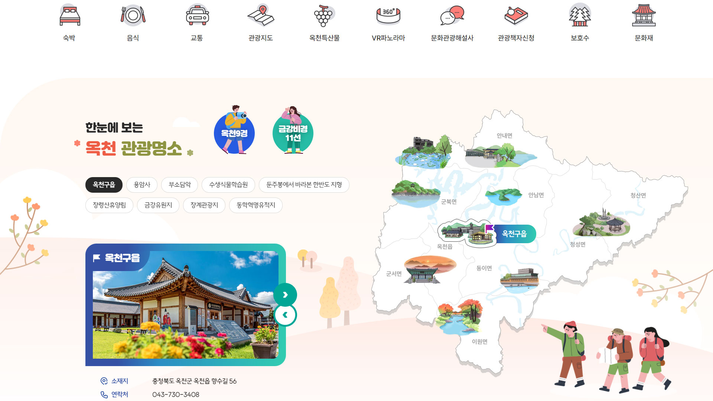
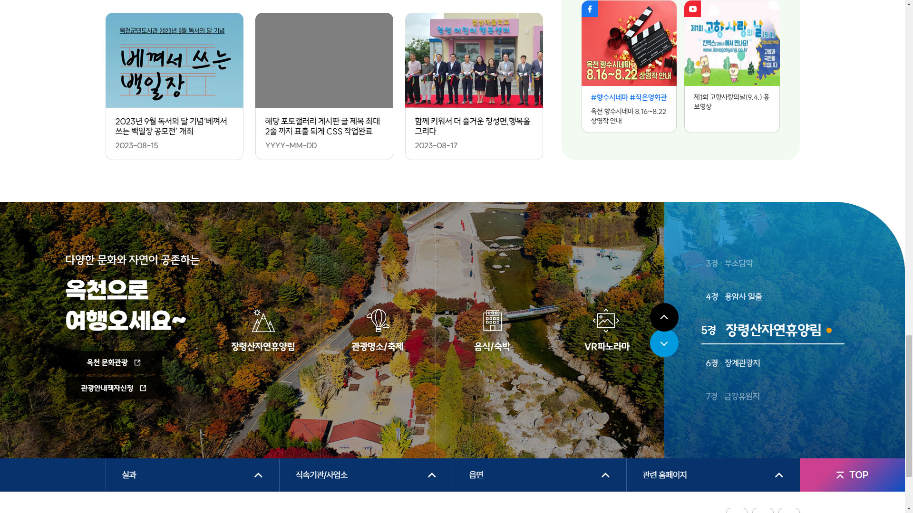
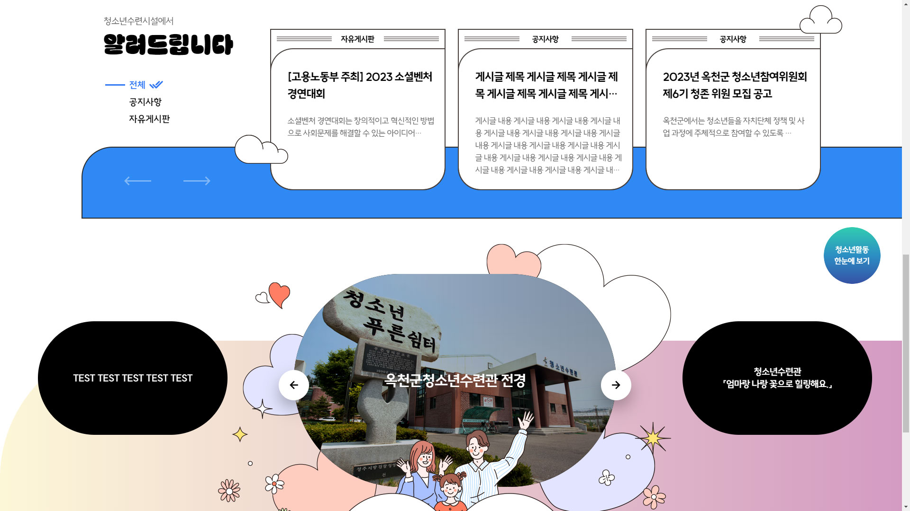
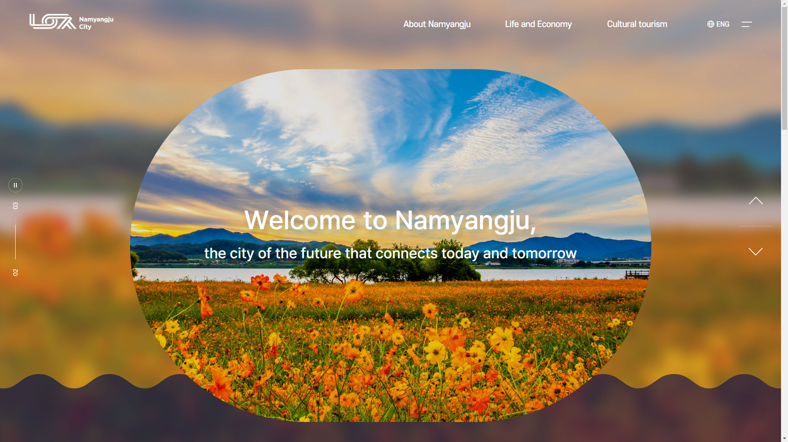
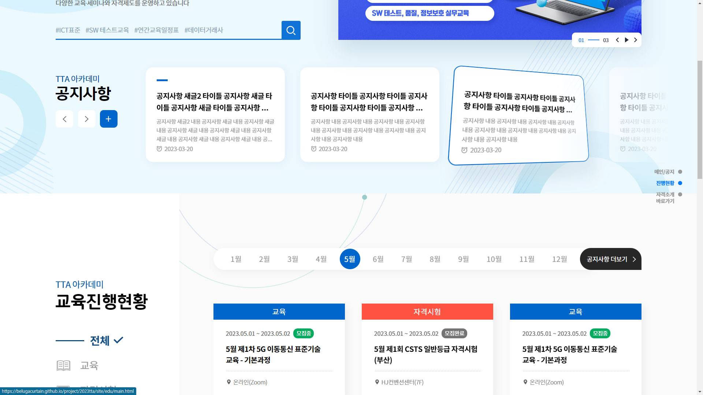
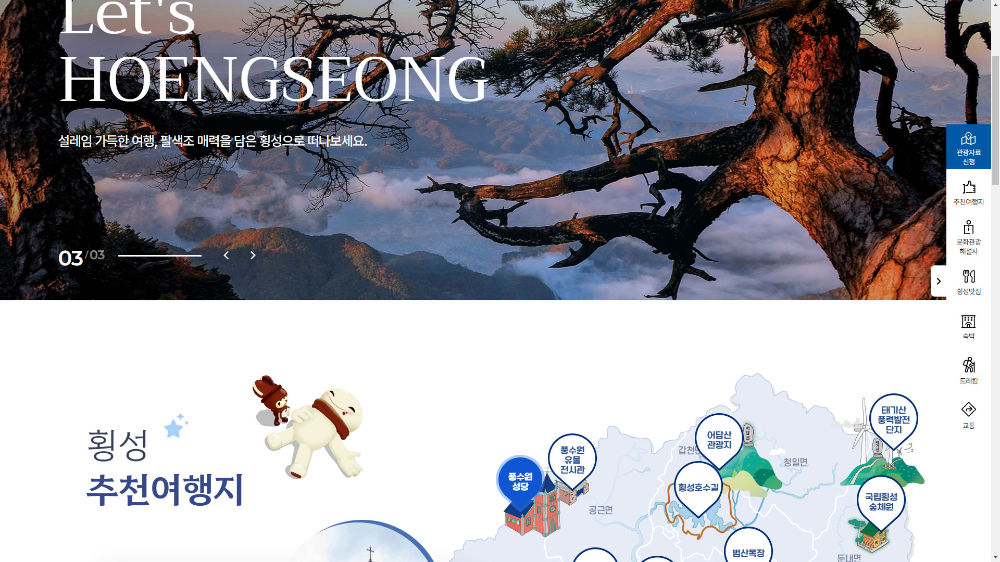
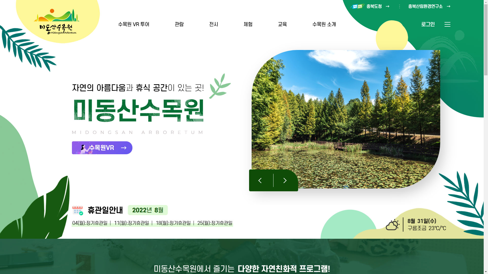
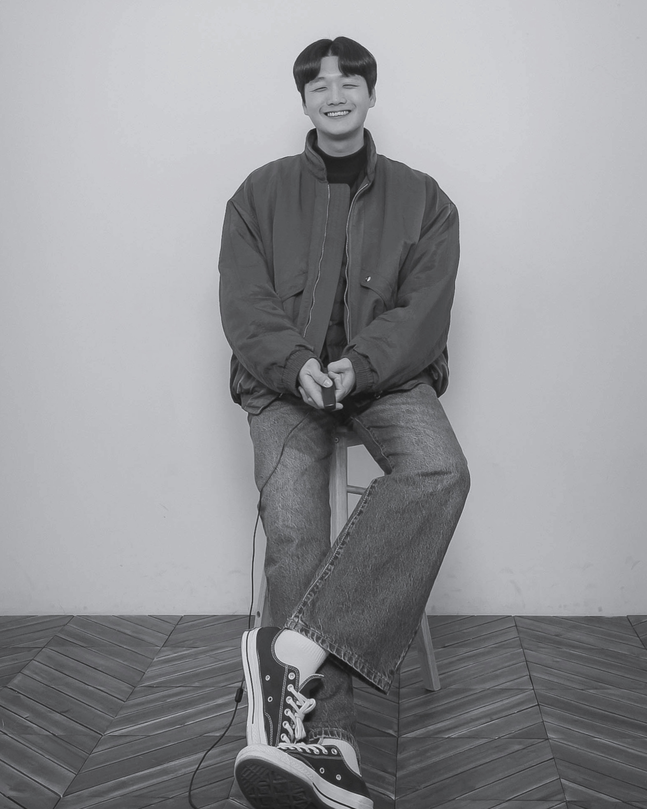

  
  
  
  
  
  
  
  

# Birth 🐶 1994. 10. 11 🥳
## Favorite Food : 🍜☕🍎 Hobby : 🎧🎤🏊‍♂️ Interest : 💸📈 MBTI : ESTJ🙄

    

# Contact

# :computer: Develop Tech :computer:
    

# :art: Design Tech :art:
  

